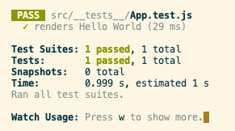

# React Testing

The React Testing Library (craeted by Kent C. Dodds) is included in the React App created by Create-React-App (CRA). It is abstracted over the DOM Testing Library as well as uses Jest as it's test environment (i.e. test runner).

To run tests (in command-line):

```
npm test
```

## Unit Testing

A unit test is generally used to test components or functions in isolation. For functions, unit tests are for input and output; for components, we test props or the callback handlers communicating to the outside.

## Setup

For every test you want to write, it needs to have .test in the file extension. 
The setup can either be:

  * ```__test__``` folders with a test file for each component 
  * ```__tests__``` folder with all test files for all the compoments. 

<strong>note:</strong>This project example has a ```__tests__ folder containing all test files.

## Testing a Component

For each test file (e.g. App.test.js), you include the ```render``` method and ```screen``` method which are from the DOM Testing Library which RTL uses as a wrapper. 

```
import { render, screen } from '@testing-library/react';
import App from './App';
```

Importing the component(s) to your test file is simulating the same effect as importing that compoment to be rendered to the browser. The React Testing Library (RTL) is simulating exactly the same process (importing to the DOM) as in your code for development.

We then write our test:

```JS
// string description with test function:
test('renders Hello World', () => {
  render(<App />);
  ...
  ...
});
```

The code example above renders the ```<App />``` compoment and any children components it uses to the virtual DOM. Once it is rendered, it then can be tested (must be rendered first).

```JS
test('renders Hello World', () => {
  render(<App />);
  const elemText = screen.getByText(/hello world$/i); 
  expect(elemText).toBeInTheDocument();
});
```

The updated code above finds a specific element inside of ```<App />``` via the <a href="https://testing-library.com/docs/queries/about/#screen">screen API</a> checking the text returned by using <a href="https://testing-library.com/docs/queries/bytext/">getByText</a> query method.

The ```/Hello World$/i``` that checks for the exact string (ignoring case) of "hello world".

So when you run ```npm test``` you will get this in your VSC terminal:



<strong>Note:</strong> Queries are the methods that Testing Library gives you to find elements on the page. There are several <a href="https://testing-library.com/docs/queries/about/">types of queries</a> ("get", "find", "query"); the difference between them is whether the query will throw an error if no element is found or if it will return a Promise and retry. 

